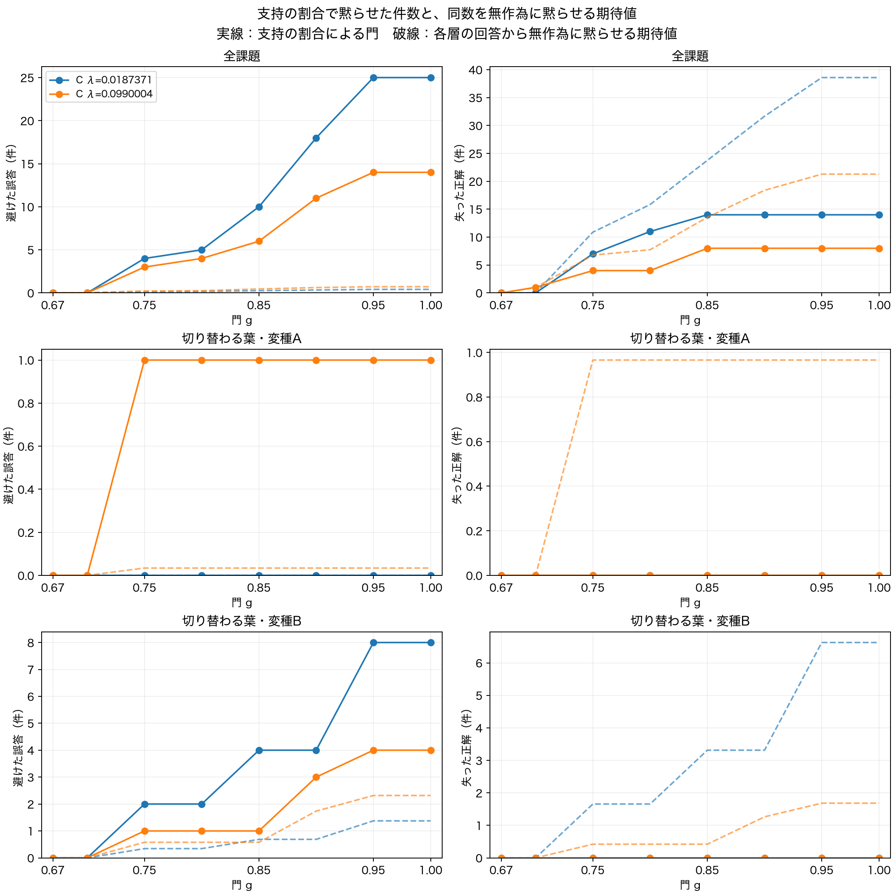
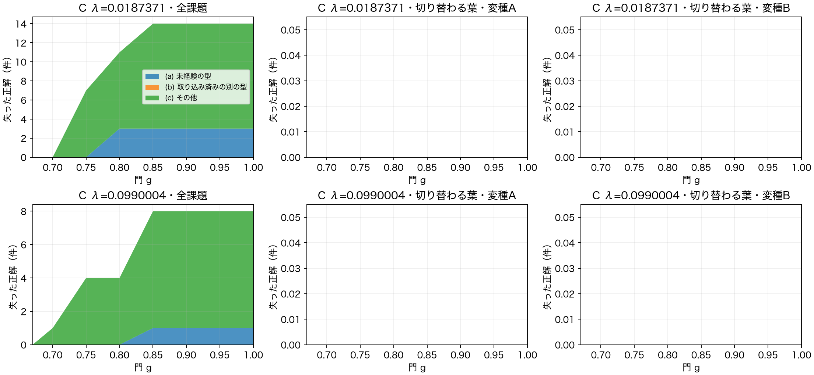

- 2026-10-02T11:06:58+09:00 委任書「世界v4の動作確認と、D・門の曲線」を受領。段1の四点と関門1から開始。

## 段1：世界v4の動作確認

保存時刻：2026-10-02T11:18:01+09:00。土台strict-pc-2026-10-01の先頭88e0e38に、10月1日の世界v4の復元と履歴キーの解析修正を重ねた。コード 143544ffba8e8b6e9d66e5f8a84d6026d5ce951b。Python3.12.13。自分の新しい作業場所 /Users/tatsu-admin/Documents/ChatGPT/New project/codex_worldv4d_2026-10-02。abm/の差分0。新しい世界の走行0。

Fは固定名を持つ席、Hは名前と回数の履歴を持つ席、Uはその中身を忘れた席。支持の割合は、名前の残るF・Hの席のうち、場面の対応が取れた席の割合。

| 点 | 確認の件数 | 結果 |
|---|---|---|
| 1 専用の定義 | 4型×2変種×伏せる葉2位置＝16例 | 正解16、誤答0、棄権0。正しい型・変種の定義の選択16 |
| 2 他方の葉が見分けの手がかり | 同じ16例 | 全例で正しい専用定義の支持15/15、反対の変種の定義11/15。割合に差がある16例 |
| 3 欠けた位置への結びつき | 10月1日の9腕×種1〜20＝180本、313200課題 | 誤答1986。対応先(i)伏せた関係1986、(ii)見えている関係0、(iii)対応先なし0 |
| 4 外れの種類を分ける | 現行の予測による重なりの小例1件 | 分類の扱いと専用定義の判定基準が未指定。集計を保留 |

1・2・3から、指定された関門1は通過。(i)以外の誤答は0/1986＝0%（基準10%以下）。

### 1・2の小例

型の木の骨組みを手で関係グラフへ置き、型×変種の8本の専用定義を保持させた。各定義は15席すべてF。物の名前・関係IDは定義と質問の場面で別。二つの切り替わる葉の一方を伏せ、他方を見せた。周縁の関係は足していない。現在の照合・定義選択・投影／穴埋め・--answer-gap・--strict-pcで予測し、その後で正誤を比較。予測に正解や型・変種の印を渡していない。全16例で予測前後の状態の指紋が一致。

| 型 | 変種 | 伏せる部分木 | 正解と予測 | 選ばれた専用定義の支持 | 反対の変種の支持 |
|---|---|---:|---|---|---|
| M1 | A | 0 | hold | 15/15 | 11/15 |
| M1 | A | 1 | break | 15/15 | 11/15 |
| M1 | B | 0 | hold_b | 15/15 | 11/15 |
| M1 | B | 1 | break_b | 15/15 | 11/15 |
| M2 | A | 0 | hold | 15/15 | 11/15 |
| M2 | A | 1 | pull | 15/15 | 11/15 |
| M2 | B | 0 | hold_b | 15/15 | 11/15 |
| M2 | B | 1 | pull_b | 15/15 | 11/15 |
| M3 | A | 0 | wrap | 15/15 | 11/15 |
| M3 | A | 1 | break | 15/15 | 11/15 |
| M3 | B | 0 | wrap_b | 15/15 | 11/15 |
| M3 | B | 1 | break_b | 15/15 | 11/15 |
| M4 | A | 0 | wrap | 15/15 | 11/15 |
| M4 | A | 1 | pull | 15/15 | 11/15 |
| M4 | B | 0 | wrap_b | 15/15 | 11/15 |
| M4 | B | 1 | pull_b | 15/15 | 11/15 |

### 3の腕ごとの数

| 腕 | 試行 | 誤答 | (i)伏せた関係 | (ii)見えている関係 | (iii)対応先なし |
|---|---:|---:|---:|---:|---:|
| v4spc_A_lam000 | 34800 | 61 | 61 | 0 | 0 |
| v4spc_A_L50 | 34800 | 328 | 328 | 0 | 0 |
| v4spc_A_L90 | 34800 | 410 | 410 | 0 | 0 |
| v4spc_A_lam020 | 34800 | 144 | 144 | 0 | 0 |
| v4spc_A_lam030 | 34800 | 52 | 52 | 0 | 0 |
| v4spc_C_L50 | 34800 | 260 | 260 | 0 | 0 |
| v4spc_C_L90 | 34800 | 493 | 493 | 0 | 0 |
| v4spc_C_lam020 | 34800 | 181 | 181 | 0 | 0 |
| v4spc_C_lam030 | 34800 | 57 | 57 | 0 | 0 |

既存の試行別表 analysis/<腕>/seed<種>/trials.csv.gz を再集計した。表中の対応先は、前回に台帳の予測直前の状態と世界を復元し、実際の採点・回答の記録と突き合わせたもの。180本を走らせ直していない。腕と種ごとの数もbinding_counts.jsonに保存。

## 仕様の確認で停止（段1の4）

委任書の「仕様に無い判断は、決めずに小さな例と一緒に書いて止まる」に従い、以下を決めずに停止。段2のDの載せ直し・旗切りの検査・本番走行は未開始。

小例：M1・変種Bの専用定義の二つの切り替わる葉だけをUにした。一方の葉hold_bを伏せ、他方のbreak_bを見せた。残る13席はF。定義の支持は13/13＝1。現在の予測はUからholdを答え、hold_bに対して誤答になった。予測前後の状態は同じ。
この一件は「変種を見分ける席がU」と「忘れた席の既定値による外れ」の両方の条件に入る。重なりを残して複数該当を数えるか、どちらかを先に分けて一分類にするかは本文に指定がない。

専用の定義の判定：同じ小例の定義は、作ったときは変種Bの専用定義だったが、現在は切り替わる名前を二つとも忘れている。現在の席の中身を判定に使うか、出生時の型・変種を判定に使うかで「専用の定義がある」の件数が変わる。現在はHでA・B両方の名を覚える場合もあり、その場合の専用性の基準も未指定。

確認事項：①三分類の重なりを複数該当として別にも数えるか、優先順を決めるか。②「正しい専用の定義」「変種の区別を持つ定義」を、現在の席の中身と出生時の型・変種のどちらで判定するか。

保存先：mac/world_v4_d_20261002/stage1/。全16例の提示・予測・全候補の支持、三点目の腕・種ごとの数、分類の重なりの小例、実行した解析のコード、コードの指紋と範囲を保存。既存の台帳は全て保持。種21〜40は解析していない。Dと門の曲線は未計測。

- 2026-10-02T11:51:48+09:00 承認された原因の優先順とF/H/Uの二軸で分類を再開。既存C・L50・種1の誤答22件で答え・出どころ・支持が一致。空き9.257GBまで低下したため、新しい世界の走行の開始を停止。既存記録の解析を並列2へ減らす。台帳の削除0。

- 2026-10-02T12:37:48+09:00 Mac復帰後の確認：Codexの分類処理は停止。完了64本の圧縮記録と検査を確認、不整合0。未完2本の出力とログを別名で保存し、残り116本の解析を並列2で再開。既存台帳の削除0。新しい世界の走行0。空き86.016GB。

## 段1の4：承認された分類で再開・終了

保存時刻：2026-10-02T12:43:25+09:00。9腕×種1〜20、180本・313200課題。新しい世界の走行0。誤答1986件について、予測直前の記憶を復元し、全ての定義を一つずつ選んだ場合の答えを計算した。選ばれていた定義の答え・F/H/Uの出どころ・支持の分子と分母は、1986件すべてで元の記録と一致。記憶の変更0。

原因は選び間違い→区別の喪失→その他の順で一つを付けた。答え直しは門を通らない定義も含む。出どころF/H/Uは別の軸として数えた。生まれた型・変種は参考列に残し、判定には使っていない。

区別を持つ定義は、現在の切り替わる二席が、それぞれF又は一方の変種の名前だけを持つHである定義。二席の一つがU、両方の名前を持つH、又は該当する二席を持たなければ、区別を持たない。正しく答える別の定義があれば選び間違い、それがなく、選ばれた定義が区別を持たないか、記憶に区別を持つ定義がなければ区別の喪失、残りをその他とした。

| 腕 | 原因 | F 固定名 | H 履歴 | U 既定値 | 合計 |
|---|---|---:|---:|---:|---:|
| v4spc_A_lam000 | 選び間違い | 35 | 0 | 0 | 35 |
| v4spc_A_lam000 | 区別の喪失 | 21 | 0 | 0 | 21 |
| v4spc_A_lam000 | その他 | 5 | 0 | 0 | 5 |
| v4spc_A_L50 | 選び間違い | 0 | 196 | 89 | 285 |
| v4spc_A_L50 | 区別の喪失 | 0 | 27 | 1 | 28 |
| v4spc_A_L50 | その他 | 0 | 10 | 5 | 15 |
| v4spc_A_L90 | 選び間違い | 0 | 74 | 131 | 205 |
| v4spc_A_L90 | 区別の喪失 | 0 | 123 | 34 | 157 |
| v4spc_A_L90 | その他 | 0 | 24 | 24 | 48 |
| v4spc_A_lam020 | 選び間違い | 0 | 3 | 16 | 19 |
| v4spc_A_lam020 | 区別の喪失 | 0 | 59 | 7 | 66 |
| v4spc_A_lam020 | その他 | 0 | 57 | 2 | 59 |
| v4spc_A_lam030 | 選び間違い | 0 | 0 | 1 | 1 |
| v4spc_A_lam030 | 区別の喪失 | 0 | 25 | 1 | 26 |
| v4spc_A_lam030 | その他 | 0 | 25 | 0 | 25 |
| v4spc_C_L50 | 選び間違い | 0 | 176 | 47 | 223 |
| v4spc_C_L50 | 区別の喪失 | 0 | 25 | 1 | 26 |
| v4spc_C_L50 | その他 | 0 | 9 | 2 | 11 |
| v4spc_C_L90 | 選び間違い | 0 | 80 | 182 | 262 |
| v4spc_C_L90 | 区別の喪失 | 0 | 160 | 39 | 199 |
| v4spc_C_L90 | その他 | 0 | 15 | 17 | 32 |
| v4spc_C_lam020 | 選び間違い | 0 | 4 | 24 | 28 |
| v4spc_C_lam020 | 区別の喪失 | 0 | 72 | 34 | 106 |
| v4spc_C_lam020 | その他 | 0 | 44 | 3 | 47 |
| v4spc_C_lam030 | 選び間違い | 0 | 0 | 3 | 3 |
| v4spc_C_lam030 | 区別の喪失 | 0 | 24 | 5 | 29 |
| v4spc_C_lam030 | その他 | 0 | 25 | 0 | 25 |

### 成績と、支持1の外れ

| 腕 | 全課題 | 正解 | 誤答 | 棄権 | 支持1の誤答 / 全誤答 | 割合 | 平均記憶ビット |
|---|---:|---:|---:|---:|---|---:|---:|
| v4spc_A_lam000 | 34800 | 26966 | 61 | 7773 | 39/61 | 63.934426% | 12926.598362 |
| v4spc_A_L50 | 34800 | 24041 | 328 | 10431 | 305/328 | 92.987805% | 12236.033621 |
| v4spc_A_L90 | 34800 | 14216 | 410 | 20174 | 387/410 | 94.390244% | 5156.383075 |
| v4spc_A_lam020 | 34800 | 4732 | 144 | 29924 | 82/144 | 56.944444% | 2975.377385 |
| v4spc_A_lam030 | 34800 | 1234 | 52 | 33514 | 18/52 | 34.615385% | 2248.761264 |
| v4spc_C_L50 | 34800 | 24391 | 260 | 10149 | 235/260 | 90.384615% | 12995.984885 |
| v4spc_C_L90 | 34800 | 14623 | 493 | 19684 | 479/493 | 97.160243% | 5883.941034 |
| v4spc_C_lam020 | 34800 | 4920 | 181 | 29699 | 133/181 | 73.480663% | 3096.828937 |
| v4spc_C_lam030 | 34800 | 1259 | 57 | 33484 | 20/57 | 35.087719% | 2260.608132 |

先の小例（変種Bの二席がU、支持13/13、holdで誤答）は、原因「区別の喪失」×出どころ「Uの既定値」。

記録：mac/world_v4_d_20261002/classification/。腕×種ごとの数、全試行の表、外れ一件ごとの全候補の答え・現在の二席・支持・門通過・正誤、解析コードと保存ファイルの指紋を保存。

全試行で世界の指紋・提示・正解・場面IDを検査。旧解析が全状態の指紋を検査済みの入力は、台帳本文のsha256が同じことを確認してその検査を再利用。誤答の予測直前の状態の指紋と、答え直し後に変わらないことは今回も確認。

門を変えた後の学習や定義の選び直しは追わない。Dの載せ直しと新しい走行は次の段。

- 2026-10-02T12:49:24+09:00 D小例9件・関連検査46件が通過。旗切りの土台の子プロセスが突然終了（BrokenProcessPool）、本文比較は未到達。途中出力を保存し、同じ旗・種1を一度再起動する。メモリの空き約23.7GBを確認。D本番の開始0。

## 段2の門の曲線：既存Cの二腕

門gは、答えるために必要な支持の割合の下限。現在の答えの支持がg未満ならその答えを黙らせたとして数えた。元の棄権はそのまま。定義の選び直しと、その後の学習は追っていない。種1〜20だけを集計。

無作為の期待値は、表の各層の実際の回答から、門で黙らせた件数と同数を無作為に選んだ場合。期待する誤答の件数＝黙らせた件数×元の誤答/(元の正解＋元の誤答)。正解も同じ式。各層の元の分母はcurves.csvに保存。

失った正解の型：(a)定義の出生型・土台型・予測時点までの同化型に含まれない型、(b)含まれるが出生型と違う型、(c)その他。型の印は解析だけに使う。

| 腕 | 課題 | g | 避けた誤答 | 失った正解 | 無作為：誤答 | 無作為：正解 | 正解の損失a | b | c |
|---|---|---:|---:|---:|---:|---:|---:|---:|---:|
| v4spc_C_L50 | 全課題 | 0.67 | 0 | 0 | 0.000000 | 0.000000 | 0 | 0 | 0 |
| v4spc_C_L50 | 全課題 | 0.70 | 0 | 0 | 0.000000 | 0.000000 | 0 | 0 | 0 |
| v4spc_C_L50 | 全課題 | 0.75 | 4 | 7 | 0.116020 | 10.883980 | 0 | 0 | 7 |
| v4spc_C_L50 | 全課題 | 0.80 | 5 | 11 | 0.168756 | 15.831244 | 3 | 0 | 8 |
| v4spc_C_L50 | 全課題 | 0.85 | 10 | 14 | 0.253134 | 23.746866 | 3 | 0 | 11 |
| v4spc_C_L50 | 全課題 | 0.90 | 18 | 14 | 0.337512 | 31.662488 | 3 | 0 | 11 |
| v4spc_C_L50 | 全課題 | 0.95 | 25 | 14 | 0.411342 | 38.588658 | 3 | 0 | 11 |
| v4spc_C_L50 | 全課題 | 1.00 | 25 | 14 | 0.411342 | 38.588658 | 3 | 0 | 11 |
| v4spc_C_L50 | 切り替わる葉A | 0.67 | 0 | 0 | 0.000000 | 0.000000 | 0 | 0 | 0 |
| v4spc_C_L50 | 切り替わる葉A | 0.70 | 0 | 0 | 0.000000 | 0.000000 | 0 | 0 | 0 |
| v4spc_C_L50 | 切り替わる葉A | 0.75 | 0 | 0 | 0.000000 | 0.000000 | 0 | 0 | 0 |
| v4spc_C_L50 | 切り替わる葉A | 0.80 | 0 | 0 | 0.000000 | 0.000000 | 0 | 0 | 0 |
| v4spc_C_L50 | 切り替わる葉A | 0.85 | 0 | 0 | 0.000000 | 0.000000 | 0 | 0 | 0 |
| v4spc_C_L50 | 切り替わる葉A | 0.90 | 0 | 0 | 0.000000 | 0.000000 | 0 | 0 | 0 |
| v4spc_C_L50 | 切り替わる葉A | 0.95 | 0 | 0 | 0.000000 | 0.000000 | 0 | 0 | 0 |
| v4spc_C_L50 | 切り替わる葉A | 1.00 | 0 | 0 | 0.000000 | 0.000000 | 0 | 0 | 0 |
| v4spc_C_L50 | 切り替わる葉B | 0.67 | 0 | 0 | 0.000000 | 0.000000 | 0 | 0 | 0 |
| v4spc_C_L50 | 切り替わる葉B | 0.70 | 0 | 0 | 0.000000 | 0.000000 | 0 | 0 | 0 |
| v4spc_C_L50 | 切り替わる葉B | 0.75 | 2 | 0 | 0.343750 | 1.656250 | 0 | 0 | 0 |
| v4spc_C_L50 | 切り替わる葉B | 0.80 | 2 | 0 | 0.343750 | 1.656250 | 0 | 0 | 0 |
| v4spc_C_L50 | 切り替わる葉B | 0.85 | 4 | 0 | 0.687500 | 3.312500 | 0 | 0 | 0 |
| v4spc_C_L50 | 切り替わる葉B | 0.90 | 4 | 0 | 0.687500 | 3.312500 | 0 | 0 | 0 |
| v4spc_C_L50 | 切り替わる葉B | 0.95 | 8 | 0 | 1.375000 | 6.625000 | 0 | 0 | 0 |
| v4spc_C_L50 | 切り替わる葉B | 1.00 | 8 | 0 | 1.375000 | 6.625000 | 0 | 0 | 0 |
| v4spc_C_L90 | 全課題 | 0.67 | 0 | 0 | 0.000000 | 0.000000 | 0 | 0 | 0 |
| v4spc_C_L90 | 全課題 | 0.70 | 0 | 1 | 0.032614 | 0.967386 | 0 | 0 | 1 |
| v4spc_C_L90 | 全課題 | 0.75 | 3 | 4 | 0.228301 | 6.771699 | 0 | 0 | 4 |
| v4spc_C_L90 | 全課題 | 0.80 | 4 | 4 | 0.260916 | 7.739084 | 0 | 0 | 4 |
| v4spc_C_L90 | 全課題 | 0.85 | 6 | 8 | 0.456602 | 13.543398 | 1 | 0 | 7 |
| v4spc_C_L90 | 全課題 | 0.90 | 11 | 8 | 0.619675 | 18.380325 | 1 | 0 | 7 |
| v4spc_C_L90 | 全課題 | 0.95 | 14 | 8 | 0.717518 | 21.282482 | 1 | 0 | 7 |
| v4spc_C_L90 | 全課題 | 1.00 | 14 | 8 | 0.717518 | 21.282482 | 1 | 0 | 7 |
| v4spc_C_L90 | 切り替わる葉A | 0.67 | 0 | 0 | 0.000000 | 0.000000 | 0 | 0 | 0 |
| v4spc_C_L90 | 切り替わる葉A | 0.70 | 0 | 0 | 0.000000 | 0.000000 | 0 | 0 | 0 |
| v4spc_C_L90 | 切り替わる葉A | 0.75 | 1 | 0 | 0.034068 | 0.965932 | 0 | 0 | 0 |
| v4spc_C_L90 | 切り替わる葉A | 0.80 | 1 | 0 | 0.034068 | 0.965932 | 0 | 0 | 0 |
| v4spc_C_L90 | 切り替わる葉A | 0.85 | 1 | 0 | 0.034068 | 0.965932 | 0 | 0 | 0 |
| v4spc_C_L90 | 切り替わる葉A | 0.90 | 1 | 0 | 0.034068 | 0.965932 | 0 | 0 | 0 |
| v4spc_C_L90 | 切り替わる葉A | 0.95 | 1 | 0 | 0.034068 | 0.965932 | 0 | 0 | 0 |
| v4spc_C_L90 | 切り替わる葉A | 1.00 | 1 | 0 | 0.034068 | 0.965932 | 0 | 0 | 0 |
| v4spc_C_L90 | 切り替わる葉B | 0.67 | 0 | 0 | 0.000000 | 0.000000 | 0 | 0 | 0 |
| v4spc_C_L90 | 切り替わる葉B | 0.70 | 0 | 0 | 0.000000 | 0.000000 | 0 | 0 | 0 |
| v4spc_C_L90 | 切り替わる葉B | 0.75 | 1 | 0 | 0.579137 | 0.420863 | 0 | 0 | 0 |
| v4spc_C_L90 | 切り替わる葉B | 0.80 | 1 | 0 | 0.579137 | 0.420863 | 0 | 0 | 0 |
| v4spc_C_L90 | 切り替わる葉B | 0.85 | 1 | 0 | 0.579137 | 0.420863 | 0 | 0 | 0 |
| v4spc_C_L90 | 切り替わる葉B | 0.90 | 3 | 0 | 1.737410 | 1.262590 | 0 | 0 | 0 |
| v4spc_C_L90 | 切り替わる葉B | 0.95 | 4 | 0 | 2.316547 | 1.683453 | 0 | 0 | 0 |
| v4spc_C_L90 | 切り替わる葉B | 1.00 | 4 | 0 | 2.316547 | 1.683453 | 0 | 0 | 0 |

保存先：mac/world_v4_d_20261002/curves_C/。数表、図（PNG・SVG）、計算と描画のコード、ファイルの指紋。

## 段2：Dの載せ直しの検査

使用の強さは、照合や回答に名前を使った回数に古さの重みを掛けた量。τは、その強さを下回ると席を薄くする境界値。e-priceは、新規と同化の記憶費用に掛ける値。

元のD実装fe8d567を探索用ブランチcodex/world-v4-d-2026-10-02へ載せた（c2639fd）。abm/の差分0。Dの小例9件、関連するB＋E・席の履歴・採点・U・棄権・世界復元の検査46件が通過。検査の一時出力は自分のchecks/だけ。土台との台帳本文の比較は種1・1740試行で実施中。

Dの走行は答え直しの診断旗cf-value・probe-worldを付けず、委任書にあるanswer-gap・strict-pc・e-price 0.0187と世界v4の確率0.8を使用。忘れる判断はDのτで行う。v39-priceも記録上0.0187。既存Cのe-priceは0.01873710622997919、v39-priceは0.0187371又は0.0990004。全条件をflag.jsonとargvに保存する。

- 旗切りの関門は通過。土台9c8e2c3とDを載せたc2639fd、種1の1740試行の台帳本文のsha256が一致：3dd87f1038314fc1869abb29f112777c4ec4732b9158caa0bbf2fee9dacf1bdf。途中で終了した初回の出力は別名で保持。Dの本番60本を並列2で開始する。

- 再開後のDは現在5/60本で、1740試行ごとの世界・状態の指紋と誤答の答え直しが通過。並列2。60本の検査が終了した後に、Dの集計と五腕の門の曲線をcontrolと結果ブランチに保存する後処理も起動。新規開始は容量の関門で止める。
