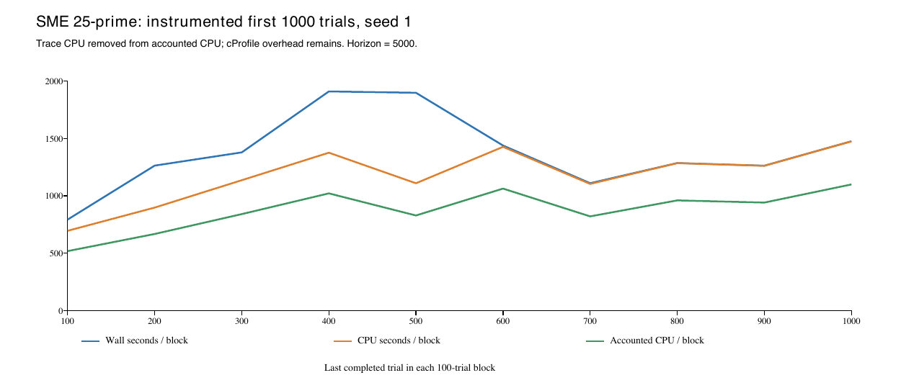
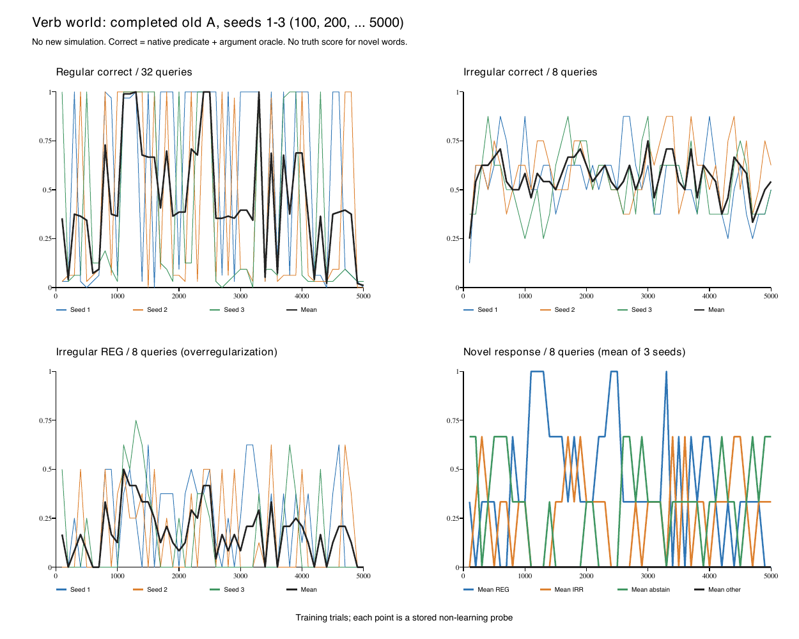

# 動詞の世界の重さと曲線（指示5・既存記録の読取）

記録時刻：2026-10-08T13:01:12+09:00。指示5の受領 `fec825b04f5ff0aed33742c6906c7c3e3ceb6f25` を通常pushした後に実施。

全部入り・種1・5,000試行の**仮の作業配分は約10〜32時間／一本**とする。開示一回の処理費用をお店から移す単純な場合は約10〜24時間、後半の第二段の費用を二倍にする感度確認では最大約31時間になる。新しい動詞版の実測ではなく、統計的な区間や保証された上限でもない。構造・席数の増加、出生の二段、注意の接続、共有機械の待ちによって32時間を越えることもある。300試行の一本の測定後に幅を更新する。

旧いA三本の曲線では、5,000試行までを通して、全体の正答と新語の答えを「ここからほぼ一定」とする時点は確認できない。不規則語には正答→REG→正答の個別の区間がある。一本の共通したU字の時期にはまとめない。これは記録の推移の記述であり、結果の良し悪しの評価ではない。

新しい模型の起動・再予測・分類の再走行は0。種21〜40の読み取り・走行は0。既存の旗off関門と固定版・旗はそのまま続けた。指示4の入口の回答はまだ待っており、注意onの接続・小走行・300試行測定を開始していない。

## 一本の重さの原記録

旧いAは三本とも `6408c7cfcf30f242e6be3aa43f646f440ad3195e`、種1〜3、保持A・U global・λ=0.01873710622997919、試行数／時間幅5,000。SME追加前の同時三本の記録。開始・終了時刻、終了コード0、台帳の完了印と5,000行を確認した。

|種|監督の実時間 秒|最大worker常駐 MB|サンプルした過程群の最大 MiB|
|---|---:|---:|---:|
|1|1411.923|202.998|241.172|
|2|1474.232|186.663|225.406|
|3|1400.967|185.172|224.125|

一本23.35〜24.57分。ただしSME・C*・第二段・注意を足した時間をこの約1,400秒で代表させない。[元の資源値と開示数](2026-10-08_動詞の世界の重さと曲線_Codex/old_timing_and_disclosures.json)。

SMEの25′は `430f329ac8918f6c084ec1abe219b880f1d6b107`、同じ種1・保持A・λ・設定5,000／時間幅5,000の先頭1,000。1,001試行目の生成前で測定を終えた。[元の報告](2026-10-06_SMEの一本の時間の内訳_Codex.md)、[100試行ごとの原CSV](2026-10-08_動詞の世界の重さと曲線_Codex/sme_100trial_timing.csv)。

|試行（1始まり）|試行区間の実時間 秒|CPU秒|traceを除いた内訳CPU秒|trace CPU秒|累積最大常駐 MB|
|---|---:|---:|---:|---:|---:|
|1〜100|791.881|694.201|517.216|176.985|153.584|
|101〜200|1262.419|896.544|666.548|229.996|174.686|
|201〜300|1377.789|1135.231|839.854|295.377|212.173|
|301〜400|1908.851|1375.092|1020.463|354.630|227.885|
|401〜500|1897.358|1108.598|827.834|280.764|251.167|
|501〜600|1437.445|1425.973|1062.194|363.778|294.371|
|601〜700|1109.108|1102.771|819.960|282.811|301.744|
|701〜800|1284.769|1284.067|959.307|324.760|313.786|
|801〜900|1261.510|1260.958|940.363|320.595|318.489|
|901〜1000|1474.822|1473.530|1098.395|375.135|496.304|

試行区間の合計実時間13,805.951秒、外の計測実時間13,822.162秒、CPU11,756.963秒、traceを除いた内訳CPU8,752.135秒。**traceを差し引いてもcProfile自体の負荷は残る**。これを計測無しの速度とはしない。内訳CPUの平均は8.752秒／試行、最後100試行は10.984秒／試行。CPUの取り合い、一時停止、I/O待ちはCPU秒と実時間の差に含まれる。

[ベクトル図SVG](2026-10-08_動詞の世界の重さと曲線_Codex/sme_profile1000_timing.svg)・[PDF](2026-10-08_動詞の世界の重さと曲線_Codex/sme_profile1000_timing.pdf)。

同じSME動詞Aの**計測器無しの完走記録**も照合の基準にした。worker9,557.714秒、監督9,562.361秒、記録された自分の一時停止899.538秒を監督から引いた計算値8,662.823秒（2.41時間、1.733秒／試行）。共有CPUの取り合いは除けていない。最大常駐637.731MB、出力1.959GiB。[既存SMEの完走報告](2026-10-06_動詞の世界_SME版_Codex.md)。同報告の `time -l real=1427.20` はuser CPUより短く時計と不一致なので今回の見積りへ使わない。25′の内訳は主に準備46.116%、記録24.532%、試験12.208%、照合器11.296%で、開示回数だけで総時間は決まらない。

## 開示の試行の割合と見積りの計算

台帳の `f_fired` を5,000試行すべてで数えた。`coin_t` は抽選値であり試行番号ではないため、試行の記録順を用いた。回答のあった行だけのanswers.csvを分母にしていない。

|種|全試行|開示あり|全試行に対する割合|過去形の課題|そのうち開示あり|
|---|---:|---:|---:|---:|---:|
|1|5000|2498|49.96%|451|223|
|2|5000|2499|49.98%|462|236|
|3|5000|2547|50.94%|468|236|
|計|15000|7544|50.2933%|1381|695|

第二段の共通コード `tools/attnstage2_runtime.py:123` は `coin.f_fired` のとき開示の処理をする。したがって現時点の試算では**5,000試行で約2,500回**、既存三本では2,498〜2,547回に相当する。過去形の開示695回だけを第二段の全回数としない。新しい全部入りの台帳をまだ測っていないので、その回数の実測とは記さない。出生FH／HUは別の仕事で、この開示回数には含めない。48問の非学習試験も開示の学習に数えない。過去形の研究者欄を読んだのはこの事後集計だけで、本人への課題入力には使わない。

お店の指定時点は世界2・種41、1,204試行・11,405.700秒、開示あり624試行（51.8272%）。第二段の開示に7,130.111秒（**総時間の62.5136%**）、出生に319.446秒。指示5の「約63%」は時間の割合で、開示試行の割合ではない。[指定時点の部分記録](attn_stage2_2026-10-07/instruction18_blocks_100_partial_20261008_1148.json)、[使用した値](2026-10-08_動詞の世界の重さと曲線_Codex/shop_seed41_1204_snapshot.json)。これは部分測定で、最終の較正価格が確定した記録ではない。

開示一回あたりの平均は7,130.111／624 = **11.426秒**。これを動詞へそのまま移すと11.426×0.502933 = **5.747秒／試行**の追加になる。世界・席数・較正・保持が違うため、移し方は仮定。

|仮定|5,000試行の計算値|
|---|---:|
|計測器無しSMEの1.733秒／試行＋上の開示費用|10.39時間|
|お店の総時間／1,204を単純に5,000へ延長|13.16時間|
|25′の内訳CPU平均8.752秒／試行＋開示費用|20.14時間|
|25′の最後100の内訳CPU10.984秒／試行＋開示費用|23.24時間|
|計測器無しSME＋開示費用を二倍にする感度確認|18.37時間|
|25′の最後100＋開示費用を二倍にする感度確認|31.22時間|

二倍は観測値ではなく、後半の仕事量の増加を見るための仮定。25′に計測の負荷が残ることも含めて、**作業配分の幅を10〜32時間／一本**とする。これは待ち時間や構造の更なる増加を保証する幅ではない。三本以上への単純な本数掛けで終了時刻を約束しない。[式・入力値・全計算](2026-10-08_動詞の世界の重さと曲線_Codex/time_forecast_scenarios.json)。

## 50時点の48問の推移

各種50時点（100,200,…,5000）、各時点48問、三本で7,200件を確認。既知の規則語32、不規則語8、新語8。既存の試験記録だけを読み、状態から再予測していない。

正答はnative `oracle=1`（述語と引数が正解と一致）、分母は既知語40問。規則語は32、不規則語は8問を分母にする。今回の既知語には「述語だけは正しいが引数は違う」という差は0件だった。過剰規則化は不規則語へのREG回答／8問で、棄権も分母に入れる。条件付きのREG／(不規則正答＋REG)もCSVの `marcus_REG_fraction` と分母に保存した。新語には正解が設定されていないため、REG・IRR1〜8・棄権・その他の割合を示し、新語の正答率は作らない。新語の事前経験が0である原記録も確認した。

[図SVG](2026-10-08_動詞の世界の重さと曲線_Codex/old_A_curves.svg)・[図PDF](2026-10-08_動詞の世界の重さと曲線_Codex/old_A_curves.pdf)。線の間に観測を補ってはいない。細線は各種、太線は三本平均。右下は三本平均の新語回答の内訳。

[全50時点×三本の表](2026-10-08_動詞の世界の重さと曲線_Codex/curves_by_seed.csv)、[三本平均の全50時点](2026-10-08_動詞の世界の重さと曲線_Codex/curves_three_seed_mean.csv)、[使用した7,200件の欄](2026-10-08_動詞の世界の重さと曲線_Codex/probe_selected_fields.csv)。各CSVに回数と分母を保存した。下は500試行区間の5時点×三本をまとめた割合（%）。

|含む試験時点|既知40正答|規則32正答|不規則8正答|不規則REG|新語REG|新語IRR|新語棄権|
|---|---:|---:|---:|---:|---:|---:|---:|
|100〜500|34.50|29.58|54.17|10.00|26.67|26.67|46.67|
|600〜1000|37.50|32.71|56.67|12.50|26.67|26.67|46.67|
|1100〜1500|79.67|86.46|52.50|40.00|86.67|6.67|6.67|
|1600〜2000|53.33|50.42|65.00|15.83|46.67|46.67|6.67|
|2100〜2500|71.50|75.42|55.83|30.00|73.33|20.00|6.67|
|2600〜3000|41.17|36.46|60.00|10.83|33.33|13.33|53.33|
|3100〜3500|51.67|49.58|60.00|20.83|46.67|26.67|26.67|
|3600〜4000|51.50|50.00|57.50|17.50|46.67|26.67|26.67|
|4100〜4500|29.33|23.33|53.33|8.33|20.00|46.67|33.33|
|4600〜5000|28.50|23.75|47.50|10.83|20.00|26.67|53.33|

全区間で新語のその他は0。個別IRR1〜8の回数もCSVにある。固定した48語の反復試験で、7,200件を独立の7,200学習試行と扱わない。

「ほぼ一定」は事後の記述として、500試行区間平均について、少なくとも最後2,000試行（4区間）を含む末尾で最大−最小が10ポイント以内かを調べた。三本平均の既知正答・不規則正答・不規則REG・新語REGは**どれも該当なし**。15ポイントへ緩めると不規則正答は2,001試行以後、不規則REGは2,501試行以後が該当するが、既知正答・新語REGには該当しない。20ポイントでも後者二つは該当しない。したがって全体の一定化時点は記さない。各種と閾値別の原計算は[記述的な末尾幅](2026-10-08_動詞の世界の重さと曲線_Codex/plateau_descriptive.json)に置いた。

## 正答→REG→正答の時期

同じ不規則語で隣り合うカテゴリーの区間が正答→REG→正答となる例は計46（種1=16、種2=16、種3=14）。一時点だけの入れ替わりを含む。前・REG・戻りの各区間が少なくとも二時点連続する例は次の5件（いずれも種1）。

|種・語|先の正答の時点|REGの時点|戻った正答の時点|
|---|---|---|---|
|1・V38|600〜1000|1100〜1200|1300〜1500|
|1・V34|1300〜2200|2300〜2400|2500〜3100|
|1・V39|2100〜2200|2300〜2600|2700〜2800|
|1・V35|2900〜3000|3100〜3200|3300〜3400|
|1・V34|2500〜3100|3200〜3300|3400〜4200|

これは100試行刻みで保存された時点の区間で、間の全学習試行に同じ回答をしたという意味ではない。[全46例と連続時点数](2026-10-08_動詞の世界の重さと曲線_Codex/word_correct_REG_correct.csv)。三本平均の不規則正答は500試行区間で47.50〜65.00%と上下を繰り返しており、三本共通の一度のU字とその開始・終わりには断定しない。

## 回答後の全部入り300試行の段取り（未実行）

[測定計画JSON](2026-10-08_動詞の世界の重さと曲線_Codex/measurement300_plan.json)へ条件、候補の全旗、開始条件と記録する欄を用意した。土台はe9ed84a、専用ローカル枝codex/verb-world-allin-2026-10-08。確定した本人への課題入力を接続した版を別に固定し、今の旗off関門のcheckout・版・旗には触れない。

- 指示4の回答を自分の受け箱で受領し、通常pushしてからその仕様に従う。研究者のheld_out_is_past・真値・生成後の経路やIDを代用しない。
- 追加旗offの全5,000・台帳／全side／保存状態／evictions全バイト一致と、確定入口でのon小走行・保存復元・非学習試験の検査を確認する。不一致なら直さず件数・欄・例を報告する。
- 種1・一worker・保持A・U globalを一本。設定試行数5,000・時間幅5,000を保ち、測定専用の入口で先頭300完了後、301生成前に正常終了する。300／300へ世界の時間幅を短縮しない。
- 共通C*／E、H Dirichlet α=1、shared ε=0.01、出生seq、logp、注意global/k2/η=0.1/allin、第二段top1/virtual/all、**stage2-birth-hu on**を候補へ記録。速度の三旗は既定off。λ=0.01873710622997919は既存Aと比較する測定候補で、正式な新較正価格を決めた扱いではない。別の確定指定が来たら実行specへその指定を固定する。
- 自分の既存監督・プロセス・resultを先に読み二重投入を防ぐ。開始直前にpsの個体workerだけでMac全体8本の条件とCPUの8枠、未分類spawn、メモリ・swap・熱・空き容量を確認。受付 `~/jobs/jobs.py run --wait --mem 2.0 --disk-path 実出力先` を候補とした。2GBは近いお店の部分ピーク1,586,413,568B×1.2の上丸めで、動詞300の初回見込み。開始前の新たな実測があれば合わせる。
- 別出力 `newport_2026-10-07/measurements/allin_s01_300/output` に、100・200・300のwall/CPU、最大RSS、第二段開示・出生・準備・記録等の時間と回数、開示試行数、席数、照合回数、出力サイズ、固定SHA・全旗、部分計測終了の印を保存する。cProfileを常時入れた秒を通常の速度にせず、時間区分の重なりも記す。

300は45番の全5,000一本の測定とも、列の本番とも区別する。指示5の完了はこの既存記録の報告と段取りの準備であり、指示3の移植・関門・on測定全体の完了ではない。

## 読み取りの実施と検証

台帳の完了印・終了コード・全5,000の記録順、各種50×48と32/8/8、試験の新語の真値／経験の非存在を検査。研究者欄を模型へ渡すコード・再予測・模型の起動は無い。読取51.746秒・最大常駐36,159,488B、jobsは0.2GB、作図は0.1GBで受付。表の予約23.5／24GB（作図時23.4）、スワップ直近10分180.0MB→180.0MBの受付を確認した。[読取の受付](2026-10-08_動詞の世界の重さと曲線_Codex/jobs_attempt3.log)、[作図の受付](2026-10-08_動詞の世界の重さと曲線_Codex/plot.jobs.log)。Mac全体の毎回の記録は指示3に従い増やしていない。既存監督の最後の資源サンプルに資源警告が無いことは確認した。

読取の事前検査で完了印のファイル名とcoin_tの意味の取り違えが検出され、その集計は採用せず、原本を確認して修正後に読み直した。模型・原本の変更0。図はSVG/PDFを生成し、画像でも目視確認した。旧いA三本・25′の入力sha256、今回の台本と出力sha256を同梱する。[入力目録](2026-10-08_動詞の世界の重さと曲線_Codex/input_manifest.json)、[台本](2026-10-08_動詞の世界の重さと曲線_Codex/read_existing.py)、[作図台本](2026-10-08_動詞の世界の重さと曲線_Codex/plot_existing.py)、[証拠目録](2026-10-08_動詞の世界の重さと曲線_Codex/evidence_manifest.json)。台本は元の専用作業位置からの相対パスを用いる。元のgzip容器・大きい模型出力はローカルに保存し、そのコピーは送らない。

継続確認は2026-10-08T13:02:56+09:00に読取完了・300の未実行計画・既存関門・回答待ちを反映し、ACTIVE・30分・期限10/9 09:00 JSTと保存文面の一致を確認した。[保存設定の検証](2026-10-08_動詞の世界の重さと曲線_Codex/automation_instruction5_20261008.json)。
